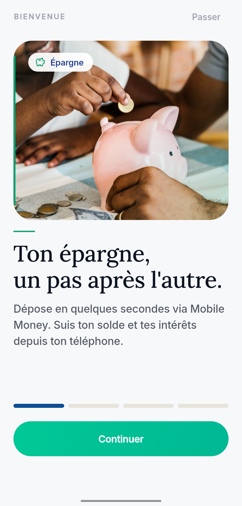
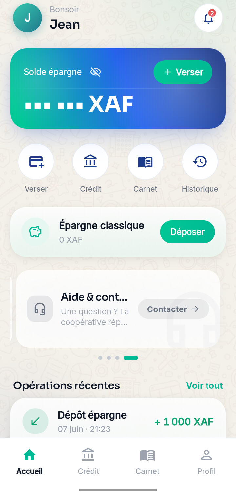
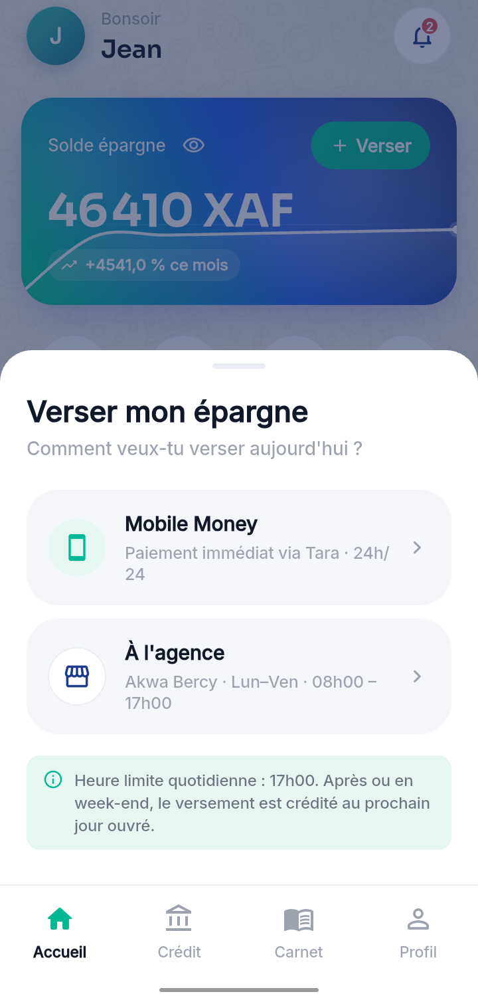
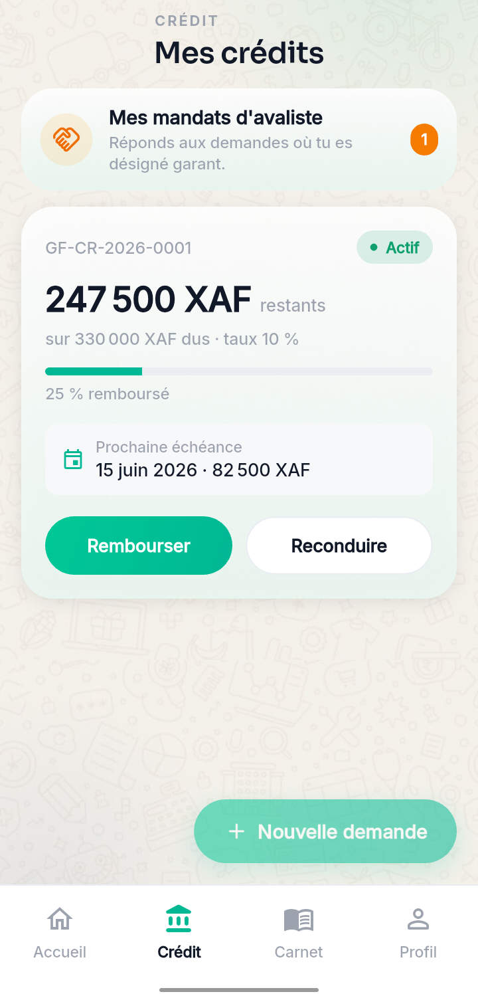
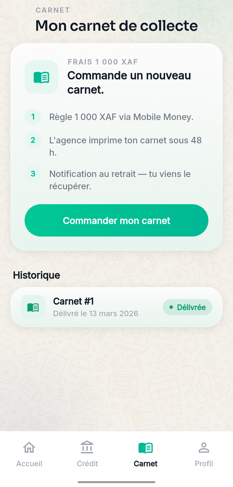
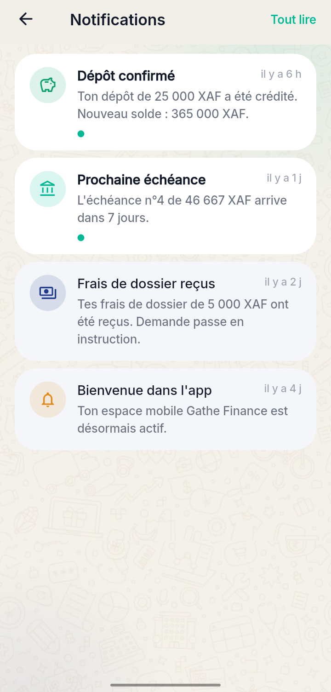
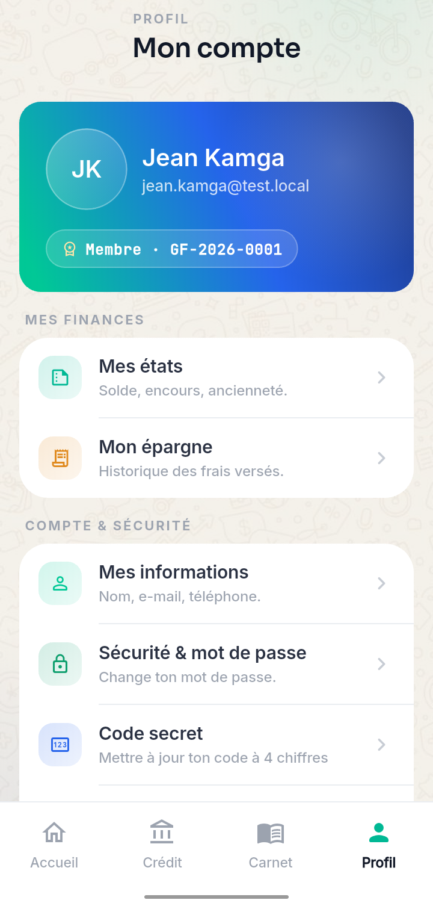
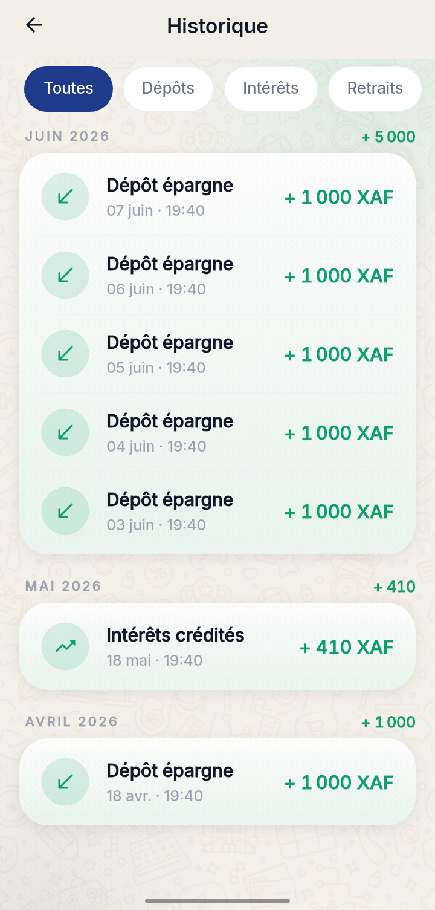

# L'application mobile GATHE Finance

## Sommaire

1. Le lancement — l'écran d'accueil
2. La découverte — les 4 premiers écrans
3. Se connecter à son compte
4. Devenir membre — le formulaire d'adhésion
5. Sécuriser l'application (code secret)
6. L'accueil de l'espace membre
7. Faire un versement
8. Suivre et gérer son crédit
9. Commander son carnet de collecte
10. Recevoir ses notifications
11. Voir et modifier son profil
12. Consulter l'historique
13. Les mandats d'avaliste
14. Bons réflexes &amp; support

### À qui s'adresse ce guide ?

Ce guide accompagne **les membres de la coopérative** dans la prise en
main de l'application mobile GATHE Finance — installation, premier
lancement, gestion courante de l'épargne et du crédit, jusqu'aux
fonctions plus avancées comme les mandats d'avaliste.

<blockquote>

**Le principe de GATHE Finance.** L'application mobile est ton
**guichet personnel** de coopérative : tu peux verser ton épargne par
Mobile Money, suivre tes crédits, commander ton carnet et recevoir les
annonces — **24h/24** depuis ton téléphone, ou en passant par
l'agence pendant les heures d'ouverture.

</blockquote>

---

<section class="step">
  
1Le lancement — l'écran d'accueil

  

    
    

      
✦Un démarrage de quelques secondes

      
Au moment où tu ouvres l'application, le logo <strong>GATHE Finance</strong>
      s'affiche quelques instants pendant que ton espace personnel se prépare.

      <ul>
        <li><strong>Première utilisation</strong> → tu verras la <em>découverte</em> (4 écrans).</li>
        <li><strong>Tu reviens, sans code secret</strong> → tu seras emmené à la connexion.</li>
        <li><strong>Tu reviens, avec code défini</strong> → tu seras invité à déverrouiller.</li>
      </ul>
    

  

</section>

<section class="step">
  
2La découverte — les 4 premiers écrans

  

    
    

      
📖Quatre promesses, quatre écrans

      <ol>
        <li><strong>Ton épargne, un pas après l'autre</strong> — déposer en quelques secondes via Mobile Money.</li>
        <li><strong>Finance tes projets au tarif coopératif</strong> — crédit basé sur ton épargne, décaissement Mobile Money.</li>
        <li><strong>Une coopérative qui appartient à ses membres</strong> — gouvernance transparente, services simplifiés.</li>
        <li><strong>Pas un client. Un copropriétaire</strong> — assemblées, votes, redistribution.</li>
      </ol>
      
Tu peux <strong>glisser vers la gauche</strong> entre les écrans, ou taper sur :chip[Passer] pour aller directement à la connexion.

    

  

</section>

<section class="step">
  
3Se connecter à son compte

  

    
    

      
🔑« Bon retour »

      
Renseigne deux champs :

      <ul>
        <li><strong>Adresse email</strong> — celle utilisée à ton adhésion.</li>
        <li><strong>Mot de passe</strong> — celui que tu as choisi (ou reçu).</li>
      </ul>
      
Mot de passe oublié ? Tape sur :chip[Mot de passe oublié ?] — un lien de réinitialisation t'est envoyé par email.

      
Pas encore membre ? :btnOutline[Devenir membre] ouvre le formulaire d'adhésion (étape 4).

      
Une fois rempli, appuie sur :btn[Se connecter].

    

  

</section>

<section class="step">
  
4Devenir membre — le formulaire d'adhésion

  

    

      
📝Huit champs prévus par le Règlement Intérieur (Article 3)

      
Le bouton :btnOutline[Devenir membre] ouvre une fenêtre avec le formulaire d'adhésion. Tu y remplis :

      <ol>
        <li><strong>Nom et prénom</strong></li>
        <li><strong>Date et lieu de naissance</strong></li>
        <li><strong>Profession</strong></li>
        <li><strong>Numéro de pièce d'identité</strong></li>
        <li><strong>Adresse</strong> (ville et quartier)</li>
        <li><strong>Numéro de téléphone</strong> (Mobile Money)</li>
        <li><strong>Adresse email</strong></li>
        <li><strong>Personne à prévenir</strong> en cas d'urgence</li>
      </ol>
      
Une fois envoyé, tu reçois un email de confirmation. La coopérative étudie ton dossier puis te programme un <strong>entretien d'admission</strong> en agence. Après décision favorable, tu peux régler tes frais d'adhésion et activer ton compte.

    

  

</section>

<section class="step">
  
5Sécuriser l'application (code secret)

  

    

      
🔒Un code à 4 chiffres pour ouvrir l'application

      
À la <strong>première connexion</strong>, l'application te demande de choisir un <strong>code secret à 4 chiffres</strong>, à confirmer en le retapant. À chaque ouverture suivante, on te demandera ce code (ou ton empreinte si tu actives la biométrie).

      <ul>
        <li><strong>Évite</strong> les combinaisons trop simples (<code>1234</code>, <code>0000</code>, date de naissance).</li>
        <li><strong>Biométrie</strong> (empreinte ou Face ID) — encore plus rapide que le code, et plus sûr.</li>
        <li><strong>Changement de code</strong> à tout moment depuis :tab[Profil] → :tab[Code secret].</li>
        <li>Après <strong>3 erreurs</strong>, l'application te demande de ressaisir ton mot de passe complet pour vérifier ton identité.</li>
      </ul>
    

  

</section>

<section class="step">
  
6L'accueil de l'espace membre

  

    
    

      
🏠Tout en un coup d'œil

      <ul>
        <li><strong>Bonjour {Prénom}</strong> + cloche des notifications (point rouge si non-lues).</li>
        <li><strong>Carte solde</strong> bleu-vert avec ton solde d'épargne et le bouton :btn[+ Verser].</li>
        <li><strong>Icône œil</strong> pour masquer ou afficher le montant (avec contrôle code secret).</li>
        <li><strong>4 raccourcis ronds</strong> : :tab[Verser] · :tab[Crédit] · :tab[Carnet] · :tab[Historique].</li>
        <li><strong>Carte Épargne classique</strong> et <strong>carte Aide &amp; contact</strong>.</li>
        <li><strong>Opérations récentes</strong> en bas (5 dernières) avec lien :chip[Voir tout].</li>
      </ul>
    

  

</section>

<section class="step">
  
7Faire un versement

  

    
    

      
💰Deux canaux à ta disposition

      
Depuis l'accueil, appuie sur :btn[+ Verser] ou le raccourci :tab[Verser]. Une fenêtre s'ouvre :

      <ul>
        <li><strong>Mobile Money via Tara</strong> — paiement <strong>immédiat 24h/24</strong>. Tu saisis le montant, valides avec ton code MOMO, et l'épargne est créditée à la confirmation.</li>
        <li><strong>À l'agence d'Akwa Bercy</strong> — Lun-Ven 08h00 — 17h00. L'agent t'accueille, saisit le versement et te remet un justificatif.</li>
      </ul>
      
<strong>Heure limite : 17h00.</strong> Après 17h, le week-end ou un jour férié, le versement est crédité <strong>le prochain jour ouvré</strong>.

    

  

</section>

<section class="step">
  
8Suivre et gérer son crédit

  

    
    

      
📋Tes crédits en un seul écran

      
Onglet :tab[Crédit] (2e du bas). Pour chaque crédit en cours :

      <ul>
        <li>Numéro du crédit, <strong>montant restant</strong>, montant total, taux appliqué.</li>
        <li><strong>Prochaine échéance</strong> avec date et montant à régler.</li>
        <li><strong>Cercle de progression</strong> — pourcentage déjà remboursé.</li>
      </ul>
      
Deux actions principales :

      <ul>
        <li>:btn[Rembourser] — paie l'échéance via Mobile Money.</li>
        <li>:btnOutline[Reconduire] — prolonge le crédit d'1 mois (1 seule fois, sans frais — Article 10/11).</li>
      </ul>
      
Bouton :btn[+ Nouvelle demande] en bas pour soumettre une demande au comité crédit.

    

  

</section>

<section class="step">
  
9Commander son carnet de collecte

  

    
    

      
📓Trois étapes simples

      
Onglet :tab[Carnet] (3e du bas). Tarif : <strong>1 000 XAF</strong>.

      <ol>
        <li>Tu <strong>règles 1 000 XAF</strong> via Mobile Money depuis l'application.</li>
        <li>L'agence <strong>imprime ton carnet</strong> sous 48 h.</li>
        <li>Tu reçois une <strong>notification au retrait</strong> — tu viens le récupérer.</li>
      </ol>
      
Bouton :btn[Commander mon carnet] pour démarrer. L'historique des carnets déjà délivrés est visible plus bas.

    

  

</section>

<section class="step">
  
10Recevoir ses notifications

  

    
    

      
🔔Toutes tes infos en un endroit

      
Accède au centre depuis la <strong>cloche en haut à droite</strong>. Cinq types de messages :

      <ul>
        <li><strong>Dépôt confirmé</strong> — après un versement validé.</li>
        <li><strong>Prochaine échéance</strong> — rappel avant une échéance de crédit.</li>
        <li><strong>Frais de dossier</strong> — confirmation de réception.</li>
        <li><strong>Bienvenue</strong> — à l'activation de ton compte.</li>
        <li><strong>Annonces</strong> — messages diffusés à tous les membres.</li>
      </ul>
      
Tape sur un message pour le marquer <strong>lu</strong>, ou :chip[Tout lire] en haut à droite.

    

  

</section>

<section class="step">
  
11Voir et modifier son profil

  

    
    

      
👤Mon compte de A à Z

      
Onglet :tab[Profil] (4e du bas). Ton identité en haut (initiales, nom, email, numéro de membre <code>GF-2026-XXXX</code>) puis les sections :

      <ul>
        <li><strong>Mes finances</strong> — :tab[Mes états] et :tab[Mon épargne] (chronologie des frais).</li>
        <li><strong>Comptes &amp; sécurité</strong> — :tab[Mes informations], :tab[Sécurité &amp; mot de passe], :tab[Code secret].</li>
        <li><strong>Préférences</strong> — notifications, langue (FR/EN), biométrie.</li>
        <li><strong>Aide &amp; contact</strong> — coordonnées agence + formulaire de contact.</li>
        <li><strong>Se déconnecter</strong> — ferme la session, retour à l'écran de connexion.</li>
      </ul>
    

  

</section>

<section class="step">
  
12Consulter l'historique

  

    
    

      
📈Toutes tes opérations classées

      
Accès depuis le raccourci :tab[Historique] de l'accueil, ou :chip[Voir tout] sous les opérations récentes. Quatre filtres :

      <ul>
        <li>:tab[Toutes] · :tab[Dépôts] · :tab[Intérêts] · :tab[Retraits]</li>
      </ul>
      
Les opérations sont <strong>regroupées par mois</strong> avec un résumé en tête. Tu peux taper sur une opération pour voir son détail (date, heure, source, référence, solde après opération).

      
Le chargement est <strong>progressif</strong> : les 30 dernières s'affichent, les suivantes se chargent automatiquement en faisant défiler.

    

  

</section>

<section class="step">
  
13Les mandats d'avaliste

  

    

      
🤝Quand un autre membre te désigne comme garant

      
Un <strong>avaliste</strong> est un membre qui se porte garant d'un autre pour une demande de crédit. Si tu es sollicité, l'application te le signale.

      
Accès depuis :tab[Crédit] → <strong>Mes mandats d'avaliste</strong> (zone en haut, visible si tu as une demande en attente). Chaque carte affiche :

      <ul>
        <li>Nom et numéro du demandeur, montant, durée, date.</li>
        <li>Statut : :chip[En attente] · :chip[Acceptée] · :chip[Refusée] · :chip[Annulée].</li>
      </ul>
      
Pour les demandes :chip[En attente], deux boutons :

      <ul>
        <li>:btn[Accepter] — tu deviens garant. L'engagement est <strong>non rétractable</strong> (règlement Q13). Tu seras sollicité si le demandeur ne rembourse pas.</li>
        <li>:btnOutline[Refuser] — l'application te demande un motif court (texte libre).</li>
      </ul>
    

  

</section>

---

# 13. Bons réflexes &amp; support

### Quelques bons réflexes au quotidien

<blockquote>

- **Garde ton code secret pour toi.** Aucun agent ne te le demandera jamais.
- **Active la biométrie** si ton téléphone le permet — plus rapide et plus sûr.
- **Vérifie ton solde** après chaque versement. Si tu ne vois pas l'opération sous 5 minutes, contacte l'agence.
- **Lis tes notifications** chaque jour — la cloche en haut à droite.
- **Mets l'app à jour** dès que le Play Store le propose.
- **En cas de doute** sur une opération, contacte immédiatement l'agence — un journal complet de tes actions est tenu.

</blockquote>

### Coordonnées &amp; support

**Agence GATHE Finance** — Akwa Bercy, Douala · Lundi à vendredi · 08h00 — 17h00

Le **numéro de téléphone** et l'**email** de la coopérative sont
affichés depuis :tab[Profil] → :tab[Aide &amp; contact]. Tu peux aussi
écrire à la coopérative directement depuis l'application en utilisant
le bouton :btn[Contacter].

---

*Document préparé par TCHAMBA TCHAKOUNTE Edwin — juin 2026.*
