# Guide d'utilisation — GATHE Finance

> Document de référence pour la prise en main complète de la plateforme :
> vitrine publique, portail membre, administration coopérative, application
> mobile. Captures réelles depuis l'environnement de test local
> (`localhost:3200/3201/3202` · backend `localhost:8200`).
>
> **Cible** : membres, équipe coopérative, personnel d'agence, démonstrations
> commerciales. Toutes les données affichées sont des données de seed (compte
> de test `jean.kamga@test.local`, admin `admin@gathe.test`).
>
> _Dernière mise à jour : 7 juin 2026._

---

## Table des matières

1. [Vue d'ensemble du système](#1-vue-densemble-du-système)
2. [Vitrine publique](#2-vitrine-publique)
3. [Portail membre (web)](#3-portail-membre-web)
4. [Administration coopérative (web)](#4-administration-coopérative-web)
5. [Application mobile](#5-application-mobile)
6. [Règles métier 2026 — rappels](#6-règles-métier-2026--rappels)
7. [Comptes de test & URLs](#7-comptes-de-test--urls)
8. [Annexes techniques](#8-annexes-techniques)

---

## 1. Vue d'ensemble du système

GATHE Finance est une plateforme coopérative complète articulée autour
de **cinq surfaces** :

| # | Surface | Public | Stack | Port dev |
|---|---|---|---|---|
| 1 | **Vitrine publique** | Visiteurs, prospects | Next.js 15 (App Router) | 3200 |
| 2 | **Portail membre** | Membres actifs/suspendus | Next.js 15 | 3201 |
| 3 | **Administration coopérative** | Staff, comité crédit | Next.js 15 | 3202 |
| 4 | **App mobile** | Membres en mobilité | Flutter (Riverpod, Dio) | — |
| 5 | **Backend API + Django admin** | Tout | Django 5.2 + DRF + django-q2 | 8200 |

L'ensemble s'appuie sur PostgreSQL 16, un provider de paiement **Tara**
(Mobile Money), un système d'envoi mail Brevo HTTP API et un cluster de
tâches asynchrones (django-q2) pour les crons métier (intérêts épargne,
commission collecte, retards crédit, etc.).

---

## 2. Vitrine publique

> URL test : <http://localhost:3200> · <http://10.133.4.210:3200> depuis un
> téléphone du même réseau wifi.

Six pages structurent l'offre : **Accueil**, **À propos**, **Services
financiers**, **Devenir membre**, **Blog**, **Contact**.

### 2.1 Page d'accueil


Le hero présente la coopérative, suivi d'une bande institutionnelle « manifeste »,
des chiffres clés du Règlement Intérieur, des **4 piliers de services**
(Crédit, Épargne, Transferts, Investissement) en grille bento asymétrique,
de la section Valeurs (4 cartes hairline), d'un teaser blog et d'une CTA
finale.

Les décors éditoriaux **MeshAccent** (gradients radiaux cobalt/terra/emerald)
et les watermarks chiffrés **02 / 03 / 04** structurent visuellement les
sections sans surcharger.

### 2.2 À propos

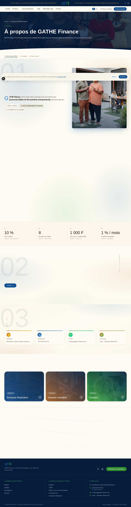

Mission, histoire, équipe (mosaïque photo 1 grand + 2 petits), gouvernance,
chiffres-clés (4 stats du Règlement). Les composants **SectionHeading**,
**HeroNumeral**, **SideRail**, **SignatureChip**, **KeyFiguresBand** et
**ExploreCard** assurent une densité éditoriale tout en gardant le rythme
respiré.

### 2.3 Services financiers

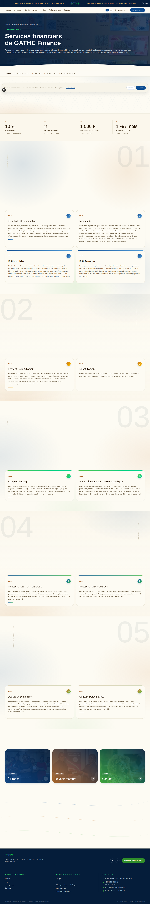

Cinq piliers détaillés : **Crédit · Transferts · Épargne · Investissement ·
Éducation financière**. Chaque pilier expose son nombre de produits avec
mini-card flottante, photo en cadre offset + halo, glass chip « Pilier 0X »,
et une grille d'ItemCard avec accent gradient au top et hairline qui s'étire
au hover.

> ⚠️ Le contenu textuel de cette page est **verbatim** depuis la source
> officielle. Aucune copy n'est inventée par le système.

### 2.4 Devenir membre

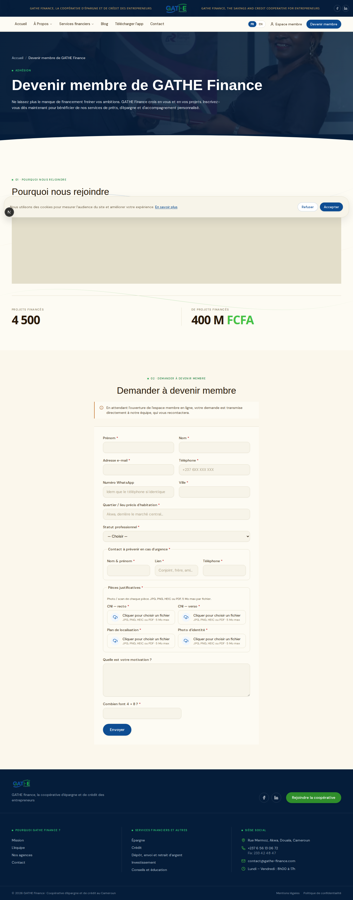

Formulaire d'adhésion en 8 champs (Article 3 du Règlement Intérieur 2025),
explication du processus, frais (10 000 XAF adhésion + 2 000 XAF inscription
+ 1 000 XAF carnet), entretien d'admission.

### 2.5 Blog

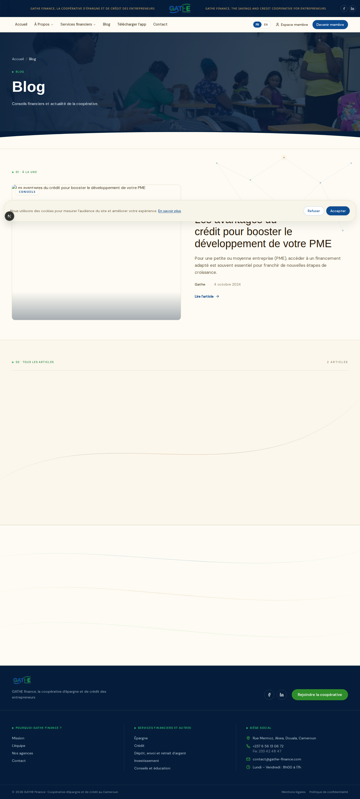

Articles éditoriaux Wagtail headless, traduits FR/EN. Catégories,
auteurs, dates, temps de lecture, image hero.

### 2.6 Contact

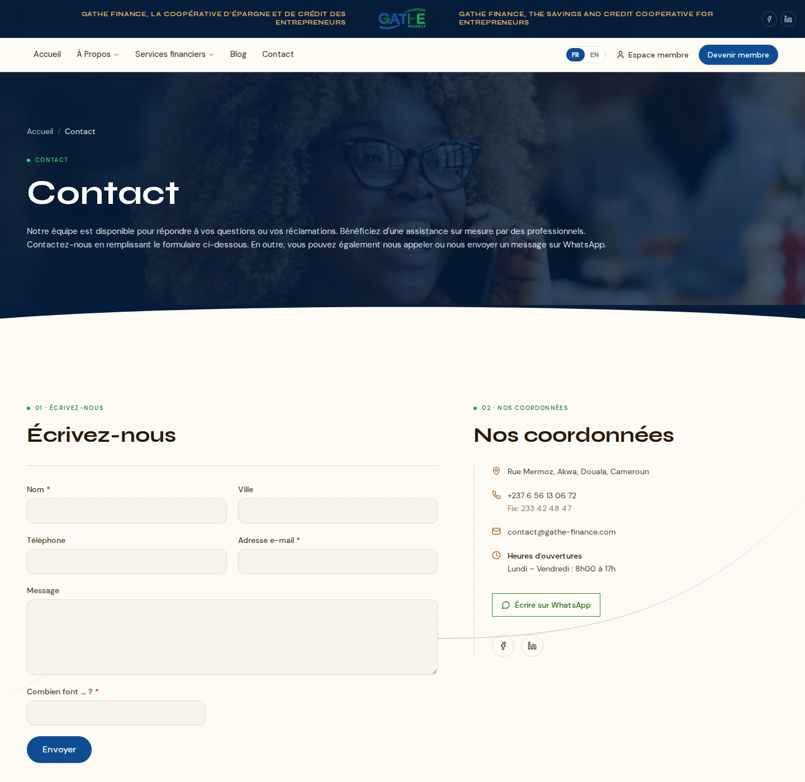

Coordonnées agence (Akwa Bercy), formulaire de contact, FAQ rapide,
liens vers réseaux sociaux.

---

## 3. Portail membre (web)

> URL test : <http://localhost:3201> · login `jean.kamga@test.local` /
> `test1234`.

### 3.1 Tableau de bord

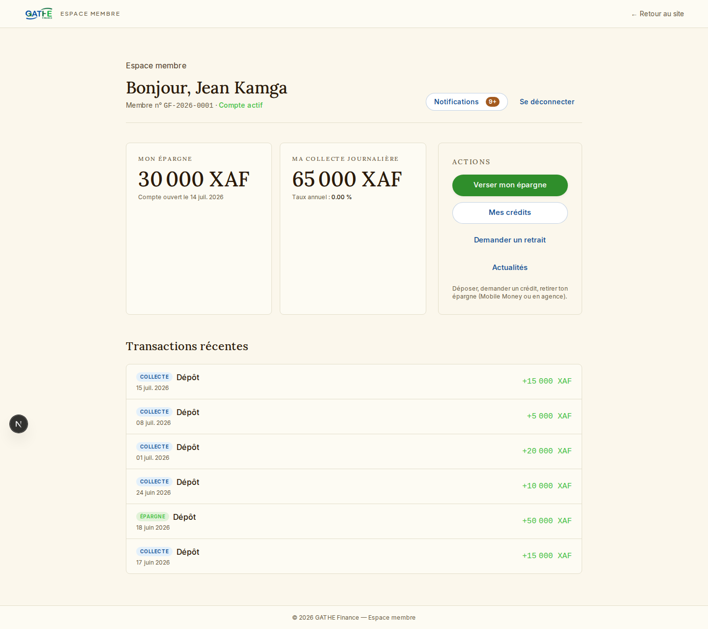

Dès la connexion, le membre voit :

- Son **identifiant** (`GF-2026-0001`) et son **statut** (actif / suspendu)
- Son **solde d'épargne** (65 000 XAF dans le seed Jean Kamga)
- Le **taux annuel appliqué** et la date d'ouverture du compte
- Les **5 dernières transactions** d'épargne (dépôts validés)
- Trois CTA d'action : **Verser mon épargne**, **Mes crédits**, **Demander un retrait**
- Un raccourci **Notifications** + lien de déconnexion

### 3.2 Notifications

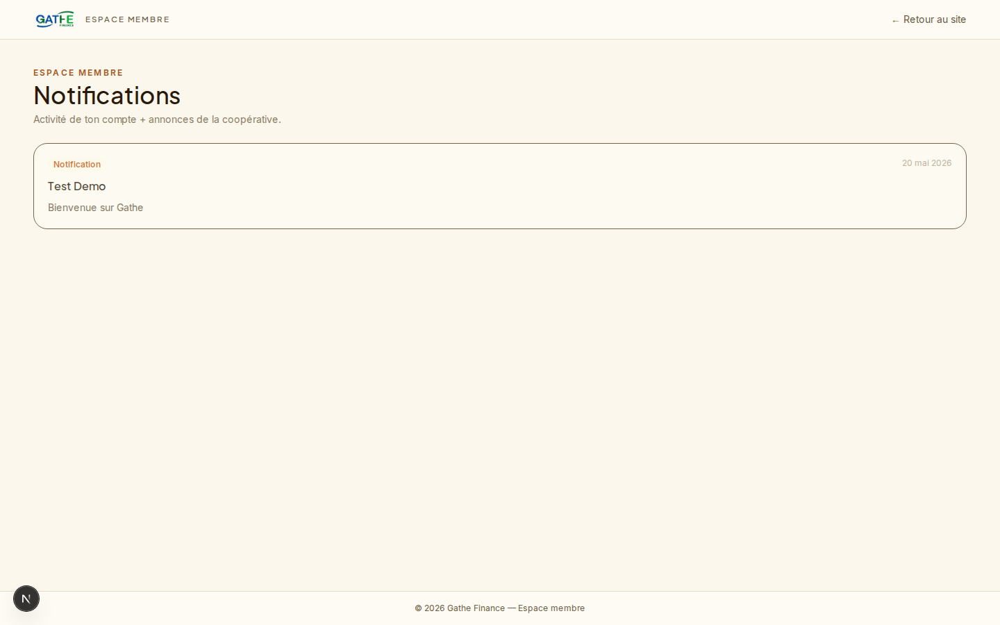

Centralise les notifications transactionnelles (dépôt validé, échéance due,
décision crédit) et les **annonces broadcast** publiées par l'admin
(audience tous / actifs / suspendus / sélection). Marquage individuel ou
global « tout lu ».

### 3.3 Crédit

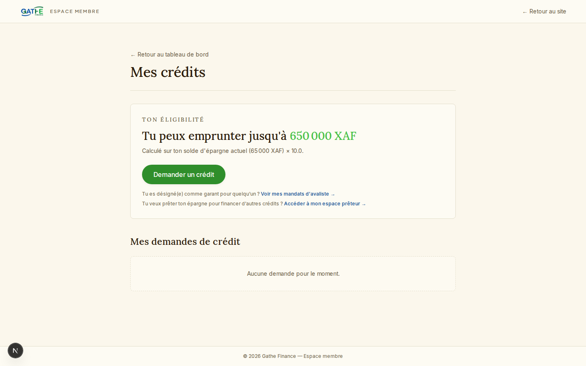

Permet de :
- **Soumettre une nouvelle demande** (montant, modalité, voie : direct /
  prêteur / micro-crédit selon les 3 voies de la refonte 2026)
- Visualiser les **crédits en cours** avec échéancier complet
- Solliciter une **reconduction** (Article 10/11 : +1 mois fixe, sans frais)
- Rembourser une **échéance** via Tara (Mobile Money)

### 3.4 Verser une épargne

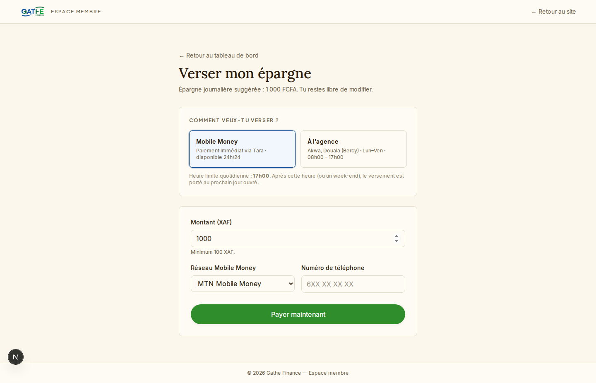

Le membre choisit entre **2 canaux** :
- **Tara Mobile Money** (paiement immédiat, validation auto via webhook)
- **Présentiel agence** (Akwa Bercy, cut-off 17h00)

### 3.5 Demander un retrait

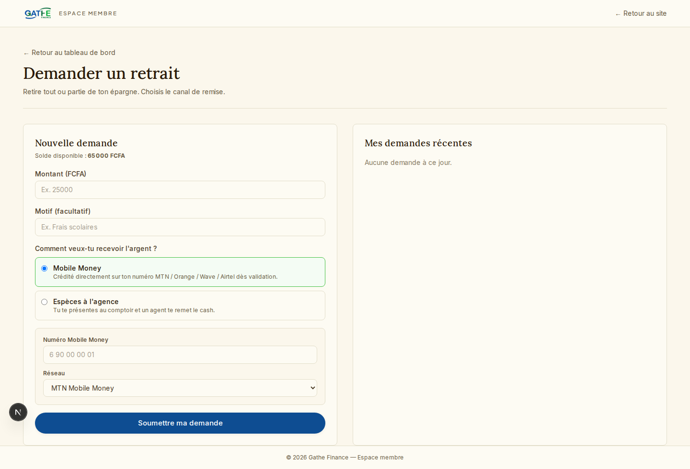

Formulaire de demande de retrait épargne avec choix du canal de payout
(MOMO Tara ou retrait en agence) et motif. Le débit du solde est atomique
côté backend (transaction `select_for_update`).

---

## 4. Administration coopérative (web)

> URL test : <http://localhost:3202> · login `admin@gathe.test` / `test1234`.

L'administration regroupe **16 sections** organisées dans une sidebar
persistante avec recherche globale **Ctrl+K**.

### 4.1 Tableau de bord


Vue d'ensemble temps réel de la coopérative :

- **KPIs principaux** : membres actifs, adhésions à instruire, crédits en
  instruction, encours crédit (1 114 644 XAF dans le seed)
- **Éligibilité 3 voies & prêteurs (Refonte 2026)** : avalistes en attente,
  campagnes en validation, prêteurs actifs, funding en cours
- **Épargne & cycles** : épargne collecte (293 000 XAF), épargne classique
  (1 105 000 XAF), cycle anniversaire, BRC validés

Le sidebar montre des **badges de file** (5 adhésions, 1 demande crédit,
1 campagne, 1 escalade) pour signaler les actions prioritaires.

### 4.2 Adhésions


Pipeline complet des demandes d'adhésion :
- Liste filtrable par statut (en attente, en entretien, approuvée, refusée)
- Détail du dossier (8 champs Article 3) + pièces justificatives
- Workflow d'**entretien d'admission** (Article 3) : programmation + saisie
  des notes + décision
- Approbation → création du compte Member en statut « suspendu » + email
  welcome avec règlement PDF attaché

### 4.3 Demandes de crédit


File des demandes en instruction par le **comité crédit** :
- Affichage des 3 voies (directe / prêteur / micro-crédit)
- Calcul automatique de la mensualité (10 % par transaction + paliers + 3
  modalités journalier/hebdo/mensuel)
- Décision : accepter / refuser avec motif → génère le décaissement Tara

### 4.4 Crédits


Vue complète des crédits actifs avec échéancier FIFO, taux de retard,
**mise en demeure** (Article 13) et état du recouvrement.

### 4.5 Paiements


Tous les paiements Tara entrants/sortants avec statut webhook, traçabilité
complète (operation, member, montant, channel, état).

### 4.6 Retraits épargne


Demandes de retrait à instruire avec décision (accepter → payout Tara
automatique ou retrait en agence).

### 4.7 Membres


Annuaire complet des membres avec filtres par statut, agence,
solde épargne, encours crédit, ancienneté.

### 4.8 Justificatifs BRC


Pipeline de validation des **BRC** (bordereaux de remise de chèque /
justificatifs de paiement présentiel) avec preview document intégré.

### 4.9 Renouvellements épargne


Cycle anniversaire des contrats épargne 12 mois : notifications J-30,
J-7, J-1 et cron qui clôture / renouvelle.

### 4.10 Campagnes micro-crédit


CRUD complet des **MicrocreditCampaign** (voie 3) : audience cible, montant
total, taux, durée, génération automatique du **flyer PDF** et export
CSV/PDF des souscripteurs.

### 4.11 Escalades judiciaires


Suivi des **JudicialEscalation** (phases A/B/C/D/E) selon le contentieux
refonte 2026 : mise en demeure → tentative amiable → recouvrement
amiable → phase judiciaire → exécution.

### 4.12 Coûts (socle modifiable)


Édition centralisée des **frais et taux** : frais d'adhésion, inscription,
carnet, taux annuel épargne, taux de transaction crédit, commission
collecte 1 % par défaut, etc.

### 4.13 Paramètres 2026 (AppSettings)


UI dédiée aux ~50 **AppSettings** de la refonte 2026 : funding 24h,
splits 50/50, paliers crédit, cron schedules, eligibility routing,
contentieux 4 phases, etc.

### 4.14 Planification (cron)


Édition de la **cadence des crons** (expression cron) + bouton **run-now**
pour rejouer manuellement avec saisie de période :

- Intérêts épargne (1 %/mois Article 4)
- Retards crédit (pénalité 50 % Article 12-13)
- Commission collecte 1 % fin de mois
- Anniversaire épargne 12 mois
- Funding 24h state machine

### 4.15 Documents officiels


Upload des documents (Règlement Intérieur PDF, statuts, agrément) avec
attachement automatique à l'email welcome.

### 4.16 Annonces broadcast


Création d'**annonces** poussées en notification à l'audience choisie :

- **Tous** les membres
- **Actifs** uniquement
- **Suspendus** uniquement
- **Sélection** par IDs

Le titre et le corps sont concaténés (`f"{titre}\n\n{corps}"`) dans la
notification. Idempotence garantie via tag `lien=ann:<id>`. Visible
immédiatement dans le portail membre + l'app mobile.

---

## 5. Application mobile

> Le mobile pointe par défaut sur le backend réel (Dio + cookies
> persistants). Lancement local sur device :
> ```bash
> cd mobile
> flutter run --dart-define=API_BASE_URL=http://10.133.4.210:8200
> ```
> Sur émulateur Android : `http://10.0.2.2:8200` à la place.
>
> Captures ci-dessous prises sur **TECNO KM5 (Android 15, 720x1600)** en
> mode `USE_MOCKS=true` (zéro backend requis).

### 5.1 Splash & Onboarding

| Splash | Préparation espace |
|---|---|
|  |  |

Le splash brandé GATHE Finance s'efface une fois les providers (auth,
PIN, onboarding) résolus.

**Onboarding 4 slides** (séquence présentée au 1er lancement) :

| Slide 1 — Épargne | Slide 2 — Crédit |
|---|---|
|  |  |

| Slide 3 — Coopérative | Slide 4 — Copropriétaire |
|---|---|
|  |  |

### 5.2 Home (espace membre)

| Haut (solde, raccourcis) | Bas (épargne classique, historique) |
|---|---|
|  | 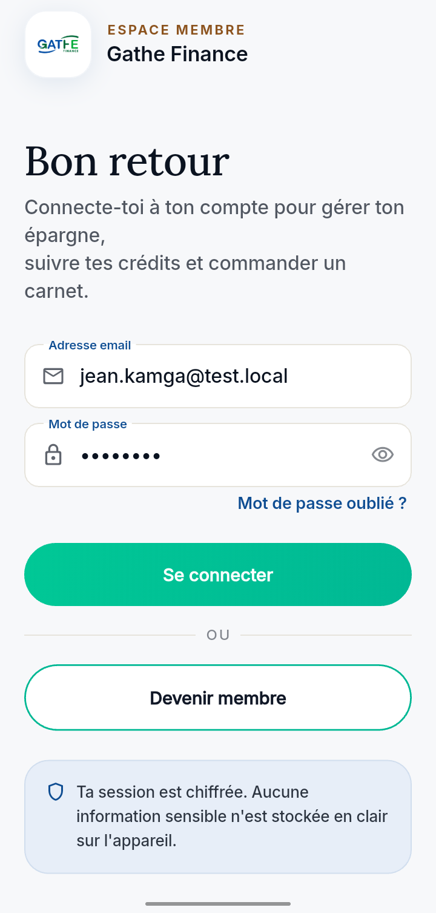 |

Le hero immersif affiche le **solde épargne** (46 410 XAF dans le seed
mock) + le taux mensuel appliqué. Quatre raccourcis : **Verser ·
Crédit · Carnet · Historique**. En dessous : carte épargne classique,
aide & contact, opérations récentes.

### 5.3 Crédit & Carnet (onglets bottom-nav)

| Crédit | Carnet de collecte |
|---|---|
|  |  |

L'onglet **Crédit** liste les crédits actifs (247 500 XAF restants sur
330 000, taux 10 %, prochaine échéance) avec actions **Rembourser** /
**Reconduire** + FAB pour une nouvelle demande, et lien vers **Mes
mandats d'avaliste** (Refonte 2026).

L'onglet **Carnet** présente le carnet de collecte (frais 1 000 XAF,
process en 3 étapes) + l'historique des carnets délivrés.

### 5.4 Profil & Notifications

| Profil | Notifications |
|---|---|
|  |  |

Le **Profil** regroupe Mes finances (états, épargne), Comptes & sécurité
(infos, mot de passe, code secret PIN), ainsi que les préférences
notifications et l'aide & contact.

Le centre de **Notifications** mixe les notifs transactionnelles (dépôt
confirmé, prochaine échéance, frais de dossier reçus) et l'annonce de
**bienvenue** envoyée à l'activation.

### 5.5 Historique épargne & Sheet versement

| Historique épargne | Sheet « Verser mon épargne » |
|---|---|
|  |  |

L'**historique** est filtrable par type (Toutes / Dépôts / Intérêts /
Retraits) avec regroupement par mois et signal vert sur les
intérêts crédités (410 XAF en mai 2026).

La **sheet versement** propose les **2 canaux** Article 1/4 du
Règlement :
- **Mobile Money** (Tara, paiement immédiat 24h/24)
- **Présentiel** Akwa Bercy (Lun-Ven 08h-17h, heure limite quotidienne
  17h00 — après c'est crédité le jour ouvré suivant)

### 5.6 Surfaces non capturées ici

Trois surfaces existent mais ne sont pas dans les captures auto (besoin
de navigation profonde / interactions) :

- **Login** + **PIN setup** / **PIN lock** + **biométrie** (parcours
  bloqué par le clavier physique sur l'auto-capture)
- **Mes mandats avaliste** (accessible depuis Crédit → bouton "Mes
  mandats d'avaliste") — refonte 2026
- **Sous-pages Profil** : Mes informations, Sécurité & mot de passe,
  Préférences notifications, Aide & contact, Mes cotisations, Mes états

### 5.2 Captures automatiques via adb

Pour un device Android connecté en USB (TECNO KM5 par défaut), le script
`scripts/capture-mobile.sh` automatise la navigation et la capture :

```bash
# Pré-requis : app installée en mode mocks (build une fois)
cd mobile && flutter run -d <DEVICE_ID> --dart-define=USE_MOCKS=true

# Puis dans un autre terminal, depuis la racine du dépôt :
./scripts/capture-mobile.sh
```

Le script effectue automatiquement (via `adb shell input tap` + `screencap`) :

- Splash, 4 slides d'onboarding, Login, PIN setup
- Home (haut + bas), Crédit, Carnet, Profil (4 onglets bottom-nav)
- Notifications, Historique épargne

Sortie : `docs/captures/mobile/{01-splash, ..., 14-historique-epargne}.png`.

> ⚠️ Les coordonnées sont calées sur **720x1600** (TECNO KM5). Pour un autre
> device, éditer les variables `NAV_*_X/Y`, `CTA_X/Y`, etc. en tête du script.

### 5.3 Captures manuelles

Si le tap automatique rate, capture manuelle :
- Sur device Android : `Power + Volume Down`
- En CLI : `adb exec-out screencap -p > capture.png`
- Sur émulateur : bouton appareil photo dans la sidebar

Nomenclature à respecter : `01-splash.png` → `14-historique-epargne.png`
dans `docs/captures/mobile/`.

### 5.7 Scénarios de démonstration mobile

#### Scénario A — Onboarding nouveau membre actif (Jean Kamga)

1. Lancer l'app → onboarding 4 slides → **Login** avec `jean.kamga@test.local`
2. Définir le **PIN** (4 chiffres) au premier lancement
3. Activer la **biométrie** (empreinte / Face ID) optionnelle
4. Arrivée sur la **Home** : solde 65 000 XAF, carousel d'infos défilantes
5. Tester **Verser ma cotisation** → sheet 2 canaux (Tara / Présentiel)

#### Scénario B — Souscription crédit (Marie Tankam)

1. Login `marie.tankam@test.local` / `test1234`
2. Onglet **Crédit** → voir le crédit actif 500 000 XAF + échéancier
3. Tester un **remboursement** (avec `PAYMENTS_TEST_AUTO_VALIDATE=true`)
4. Vérifier que l'échéance bascule en « Payée » et que le solde restant
   diminue

#### Scénario C — Membre suspendu (Paul Mbida)

1. Login `paul.suspendu@test.local`
2. CTA **Activer mon compte** → frais d'adhésion 10 000 XAF
3. Payer via Tara mock → bascule en « actif »

#### Scénario D — Annonce broadcast reçue

1. Pendant que le mobile est ouvert, créer une annonce depuis l'admin
2. Tirer pour rafraîchir l'onglet **Notifications** → l'annonce apparaît
   avec l'icône campagne + corps complet

---

## 6. Règles métier 2026 — rappels

> Source de vérité : `architecture/BUSINESS_RULES_2026.md` (refonte gelée).

### 6.1 Trois produits séparés

1. **Épargne collecte** (compte journalier) — commission 1 % à la clôture
   mensuelle (tunable via AppSetting)
2. **Épargne classique** (contrat 12 mois) — taux annuel 1 %/mois (Article 4)
3. **Crédit** — 3 voies (directe / prêteur / micro-crédit)

### 6.2 Trois voies de crédit

| Voie | Description |
|---|---|
| **Directe** | Crédit sur fonds propres de la coopérative (instruction comité) |
| **Prêteur** | Crédit sur fonds d'un membre prêteur (split 50/50 intérêts) |
| **Micro-crédit** | Campagne ciblée audience (avec flyer + export) |

### 6.3 Funding state machine 24h

Pour les voies **prêteur** et **micro-crédit**, le funding suit une state
machine à 24h : **PENDING** → **FUNDED** → **DISBURSED** ou
**REALLOCATING** si pas funded à temps.

### 6.4 Contentieux 4 phases

1. **Mise en demeure** (Article 13)
2. **Tentative amiable**
3. **Recouvrement amiable**
4. **Phase judiciaire / exécution**

### 6.5 Reconduction crédit (Article 10/11)

- **+1 mois fixe**, sans frais (refonte 2026)
- Taux **10 %** (comptant) ou **15 %** (reporté) sur capital restant
- 1 seule reconduction autorisée

### 6.6 Pénalité retard

50 % du montant de l'échéance en retard (Article 12).

### 6.7 Frais standards

| Frais | Montant XAF |
|---|---|
| Adhésion (one-shot) | 10 000 |
| Inscription | 2 000 |
| Carnet | 1 000 |

### 6.8 AppSettings tunables (~50)

Toute la configuration (taux, paliers, splits, cron schedules, audiences)
est éditable depuis **Admin → Paramètres 2026** sans déploiement.

---

## 7. Comptes de test & URLs

### 7.1 Comptes (mot de passe partagé : `test1234`)

#### Staff (admin + Django admin)

| Login | Rôle |
|---|---|
| `admin@gathe.test` | Superuser |
| `comite@gathe.test` | Comité crédit |
| `staff@gathe.test` | Lecture seule (KPIs) |

#### Membres (portail + mobile)

| Login | Statut | Données pré-câblées |
|---|---|---|
| `jean.kamga@test.local` | Actif | 65 000 XAF épargne · `GF-2026-0001` |
| `marie.tankam@test.local` | Actif | Crédit 500 000 XAF · 12 échéances · `GF-2026-0002` |
| `paul.suspendu@test.local` | Suspendu | À activer · `GF-2026-0003` |

#### Demandes d'adhésion en attente

| Demandeur | Email | Ville |
|---|---|---|
| Aline Tchamba | `aline.tchamba@test.local` | Yaoundé |
| Bertrand Nguemo | `bertrand.nguemo@test.local` | Bafoussam |

#### Rejouer le seed

```bash
docker compose exec backend python manage.py seed_test_accounts
```

### 7.2 URLs

#### Depuis le poste local

| Service | URL |
|---|---|
| Vitrine | <http://localhost:3200> |
| Portail | <http://localhost:3201> |
| Admin | <http://localhost:3202> |
| Django admin | <http://localhost:8200/admin/> |
| API v1 | <http://localhost:8200/api/v1/> |
| Swagger / OpenAPI | <http://localhost:8200/api/schema/swagger-ui/> |

#### Depuis un téléphone (même wifi)

IP du poste : **`10.133.4.210`** (LAN). Backend CORS configuré pour
accepter automatiquement `10.x.x.x` / `192.168.x.x` / `172.16-31.x.x` sur
les ports 3200-3299.

| Service | URL téléphone |
|---|---|
| Vitrine | <http://10.133.4.210:3200> |
| Portail | <http://10.133.4.210:3201> |
| Admin | <http://10.133.4.210:3202> |
| Backend API (mobile) | <http://10.133.4.210:8200> |

> Si l'IP change (DHCP, redémarrage), `ip a` ou `ifconfig` redonne la
> valeur — rien à reconfigurer côté backend.

---

## 8. Annexes techniques

### 8.1 Lancement de la stack

```bash
docker compose up -d                # vitrine + portail + admin + backend + db + qcluster
docker compose logs -f backend      # logs backend
docker compose restart backend      # redémarrage backend
```

### 8.2 Mode test paiement auto-validé

Pour rejouer les flows métier sans dépendre du provider Tara :

```bash
export PAYMENTS_TEST_AUTO_VALIDATE=true
```

Chaque `POST /payments/init/` est alors **immédiatement validé** comme si
Tara avait répondu OK — les hooks métier se déclenchent normalement.

> ⚠️ Ce flag n'est **JAMAIS** activé en production réelle.

### 8.3 Régénérer les captures web

```bash
node scripts/capture-web.mjs
```

Le script Playwright capture les 6 pages vitrine + 5 pages portail
(loguées Jean) + 16 pages admin (loguées admin) → `docs/captures/web/`.

### 8.4 Crons métier (django-q2)

| Cron | Cadence par défaut | Rôle |
|---|---|---|
| `interets_epargne` | Mensuel (1er à 00h05) | Crédite 1 %/mois Article 4 |
| `commission_collecte` | Mensuel (dernier jour 23h55) | Prélève 1 % collecte journalière |
| `retards_credit` | Quotidien (00h15) | Pénalité 50 % Article 12-13 |
| `anniversaire_epargne` | Quotidien (08h00) | Notifie J-30 / J-7 / J-1 |
| `funding_24h` | Toutes les heures | Avance la state machine PENDING → FUNDED |

Cadences éditables depuis **Admin → Planification (cron)**.

### 8.5 Email — Brevo HTTP API

15 templates seedés (welcome, dépôt validé, échéance due, décision crédit,
annonce, etc.). Clé API posée par l'admin via `BREVO_API_KEY` sur le
serveur. Welcome attaché du Règlement PDF, envoyé `on_commit`.

### 8.6 Architecture des dossiers

```
gathe_finance/
├── backend/                       Django 5.2 + DRF + django-q2
│   ├── apps_cms/                  Wagtail CMS (vitrine headless)
│   ├── apps_coop/                 Apps métier coopérative
│   │   ├── members/
│   │   ├── savings/
│   │   ├── loans/
│   │   ├── payments/              + provider Tara
│   │   ├── notifications/         (+ announcements)
│   │   └── audit/
│   └── config/settings/           {base,dev,prod}.py
├── frontend/
│   ├── apps/site/                 Vitrine publique (3200)
│   ├── apps/portal/               Portail membre (3201)
│   ├── apps/admin/                Administration (3202)
│   └── packages/{ui,config}/      Design system partagé (verrouillés)
├── mobile/                        Flutter (Riverpod + Dio)
├── architecture/                  Docs métier + ADRs
├── docs/                          Guides utilisation + captures
├── infra/                         docker-compose prod + Traefik + LE
└── scripts/                       Outils dev (capture Playwright, etc.)
```

---

## 9. Annexe — Reprendre un environnement propre

Si l'environnement local est cassé ou pour repartir d'un état clean :

```bash
# Stop + clean db + repop seed
docker compose down -v
docker compose up -d
docker compose exec backend python manage.py migrate
docker compose exec backend python manage.py seed_test_accounts
docker compose exec backend python manage.py seed_demo_dashboard

# Vérifier que toutes les surfaces répondent
curl -fsS http://localhost:3200/ > /dev/null && echo "vitrine OK"
curl -fsS http://localhost:3201/ > /dev/null && echo "portail OK"
curl -fsS http://localhost:3202/ > /dev/null && echo "admin OK"
curl -fsS http://localhost:8200/api/schema/ > /dev/null && echo "backend OK"

# Re-capturer
node scripts/capture-web.mjs
```

---

*Document généré et maintenu dans `docs/GUIDE_UTILISATION.md`.*
*Captures dans `docs/captures/{web,mobile}/`.*
*Playbook de test associé : `docs/GUIDE_TEST.md`.*
