# Le dashboard administrateur GATHE Finance

## Sommaire

1. Vue d'ensemble du dashboard
2. Le tableau de bord
3. Les adhésions
4. Les demandes de crédit
5. Les crédits en cours
6. Les paiements
7. Les retraits d'épargne
8. L'annuaire des membres
9. Les justificatifs BRC
10. Les renouvellements épargne
11. Les campagnes micro-crédit
12. Les escalades judiciaires
13. Les coûts (frais &amp; taux)
14. Les paramètres
15. La planification automatique
16. Les documents officiels
17. Les annonces broadcast
18. Bonnes pratiques administrateur
19. Coordonnées &amp; support

### À qui s'adresse ce guide ?

Ce manuel est destiné aux **équipes de la coopérative** qui pilotent
l'activité au quotidien : agents d'accueil, comité crédit,
superviseurs, direction. Il décrit toutes les **fonctionnalités** du
dashboard d'administration, **section par section**, avec les workflows
et les bonnes pratiques.

<blockquote>

**Le principe du dashboard.** Le dashboard regroupe l'ensemble du cycle
de vie coopératif — **adhésions, crédits, paiements, retraits,
contentieux, communications** — derrière une seule interface. Une
**barre latérale** persistante donne accès aux 16 sections, complétée
par une **recherche globale** (`Ctrl + K`) pour atteindre n'importe
quel dossier en quelques touches.

</blockquote>

### Les rôles utilisateurs

| Rôle | Périmètre | Actions principales |
|---|---|---|
| :chip[Superviseur] | Tout | Voit tout, décide tout, ajuste les paramètres |
| :chip[Comité crédit] | Crédits | Instruit et décide les demandes |
| :chip[Staff lecture] | KPIs et listes | Consulte, ne décide pas |

---

# 1. Vue d'ensemble du dashboard

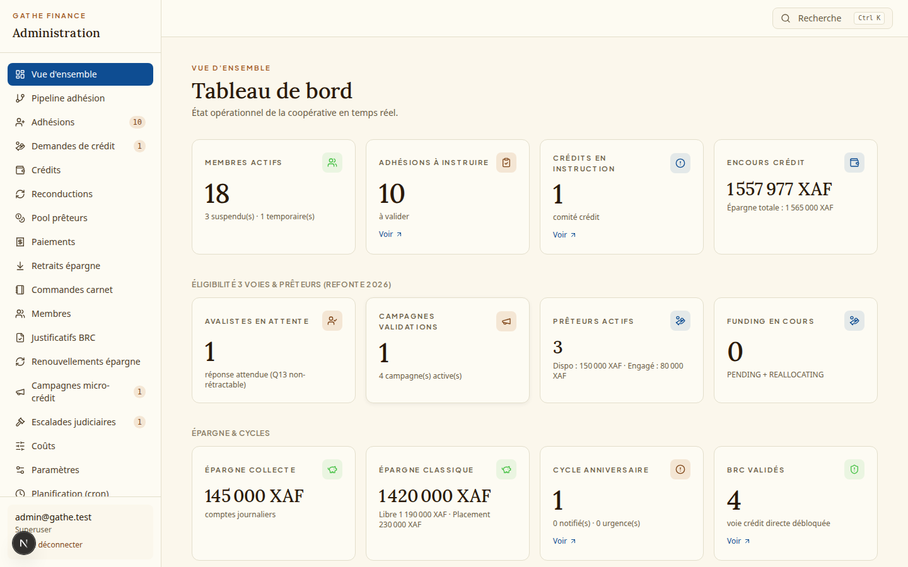

À la connexion, l'administrateur arrive sur le **tableau de bord**.
C'est l'écran qui résume **l'état de santé de la coopérative en temps
réel**. Il est organisé en trois grandes bandes d'indicateurs.

### Les fonctionnalités transverses

Présentes sur **toutes les pages** :

- **Barre latérale** persistante avec les 16 sections et des
  **badges rouges** pour signaler les actions prioritaires.
- **Recherche globale** activée par `Ctrl + K` — retrouve un membre,
  un dossier ou un paramètre en quelques touches.
- **Export CSV et PDF** sur la plupart des listes.
- **Journal d'audit** automatique de chaque décision sensible.

---

# 2. Le tableau de bord

Le tableau de bord se lit en **trois bandes** complémentaires.

### Bande 1 — Les indicateurs principaux

Quatre vignettes synthétiques :

- :chip[Membres actifs] — l'effectif aujourd'hui
- :chip[Adhésions à instruire] — file d'attente côté agents
- :chip[Crédits en instruction] — dossiers attendus par le comité
- :chip[Encours crédit total] — capital restant dû par les emprunteurs,
  avec l'**épargne totale** correspondante

Chaque vignette propose un lien :chip[Voir] qui ouvre la page détaillée.

### Bande 2 — Éligibilité &amp; prêteurs

Quatre indicateurs liés au modèle 2026 (3 voies de crédit) :

- :chip[Avalistes en attente] — désignations à confirmer
- :chip[Campagnes en validation] — micro-crédit (voie 3)
- :chip[Prêteurs actifs] — voie 2 (épargne-prêteur)
- :chip[Funding en cours] — financement en cours de constitution

### Bande 3 — Épargne &amp; cycles

Quatre indicateurs côté épargne :

- :chip[Épargne collecte] — comptes de collecte journalière
- :chip[Épargne classique] — contrats 12 mois
- :chip[Cycle anniversaire] — renouvellements imminents
- :chip[BRC validés] — justificatifs traités

---

# 3. Les adhésions

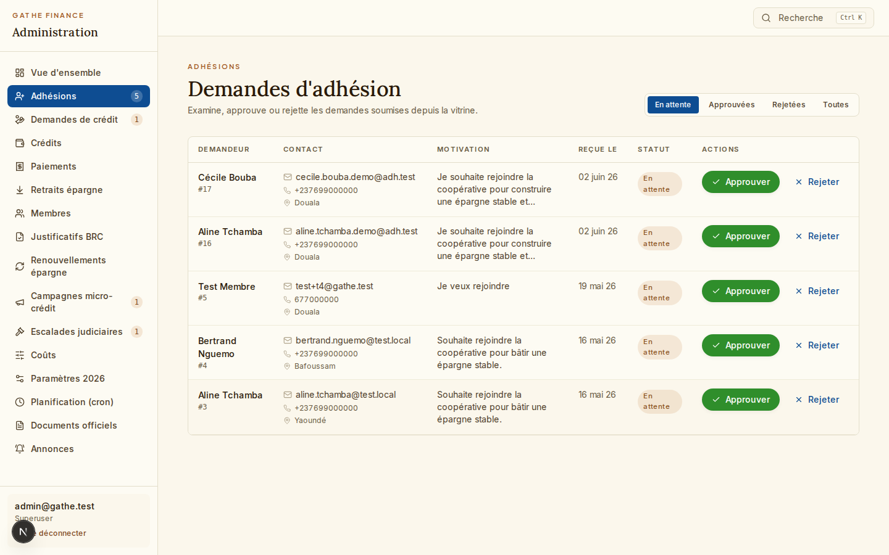

Pipeline de gestion des candidatures, depuis le dépôt du formulaire
jusqu'à l'**activation du compte**.

### Les statuts d'une demande

| Statut | Action attendue |
|---|---|
| :chip[En attente] | Étudier le dossier, programmer un entretien |
| :chip[En entretien] | Conduire le rendez-vous, prendre des notes |
| :chip[Approuvée] | Attendre le règlement des frais d'adhésion |
| :chip[Refusée] | Cas clos, le motif est gardé en historique |

### Le workflow

1. **Consulter** le détail : 8 champs du formulaire + pièces jointes
2. **Programmer** l'entretien d'admission (date, lieu, agent)
3. **Saisir** les notes après la rencontre
4. **Décider** : :btn[Accepter] ou :btn[Refuser] avec motif
5. À l'acceptation, le compte est créé en statut :chip[suspendu]
6. Un email :chip[Bienvenue] est envoyé automatiquement avec le **PDF
   du Règlement Intérieur** en pièce jointe

<blockquote>

Le statut :chip[suspendu] bloque les opérations métier tant que les
**frais d'adhésion** ne sont pas réglés. Une fois payés, le compte
bascule automatiquement en :chip[actif].

</blockquote>

---

# 4. Les demandes de crédit

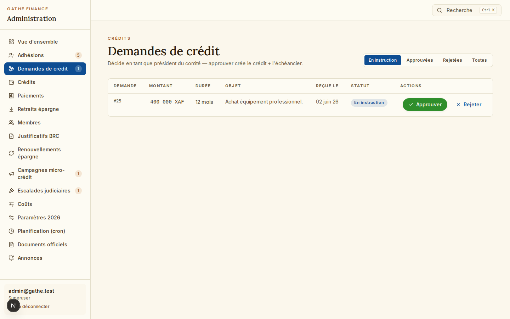

File des demandes en attente d'instruction par le **comité crédit**.

### Le contenu d'une fiche demande

- **Demandeur** : nom, numéro de membre, ancienneté
- **Montant** demandé et **durée**
- **Voie automatique** calculée selon les seuils d'éligibilité :
  - :chip[Voie 1 — Directe] : épargne suffisante
  - :chip[Voie 2 — Prêteur] : un membre prêteur intervient
  - :chip[Voie 3 — Micro-crédit] : campagne ouverte
- **Mensualité prévue** avec paliers et taux
- **Avaliste** désigné (si applicable)
- **Motif** du crédit

### La décision

- :btn[Accepter] — déclenche le **décaissement Mobile Money** et la
  création des **échéances**
- :btnOutline[Refuser] — motif obligatoire, le membre est notifié

À l'acceptation :

1. Le **payout** est envoyé sur le numéro Mobile Money du demandeur
2. Les **échéances** sont créées dans l'échéancier
3. Le membre reçoit une **notification** + email avec son tableau d'amortissement
4. L'avaliste éventuel est notifié de son engagement

---

# 5. Les crédits en cours

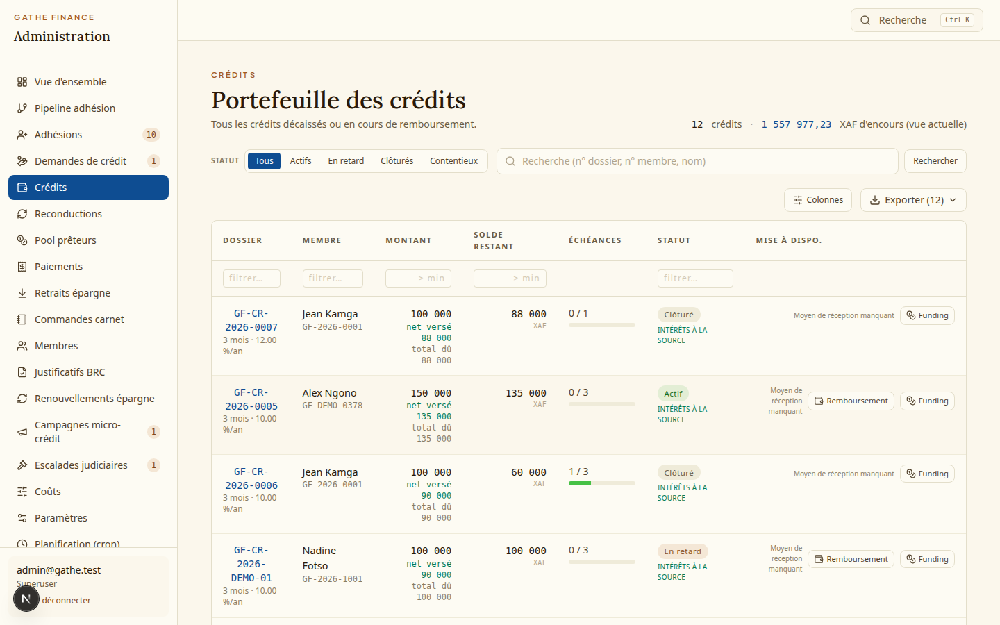

Vue complète de **tous les crédits actifs** dans la coopérative.

### Les informations affichées

Pour chaque crédit :

- **Numéro** et **demandeur**
- **Montant total**, **restant à rembourser**, **pourcentage** déjà remboursé
- **Date** de décaissement et **échéance finale**
- **État** : :chip[À jour] · :chip[En retard] · :chip[Contentieux]

### L'échéancier

Chaque crédit dispose d'un **échéancier détaillé**. Les remboursements
sont imputés dans l'ordre :

1. D'abord les **intérêts**
2. Ensuite les **pénalités** éventuelles
3. Enfin le **capital** restant

### Les actions par crédit

- :btn[Marquer en retard] — bascule l'échéance en pénalité (Article 12-13)
- :btn[Mise en demeure] — déclenche la phase A du contentieux (Article 13)
- :btn[Solder le crédit] — clôture le dossier
- :btn[Voir le membre] — accès à la fiche complète

---

# 6. Les paiements

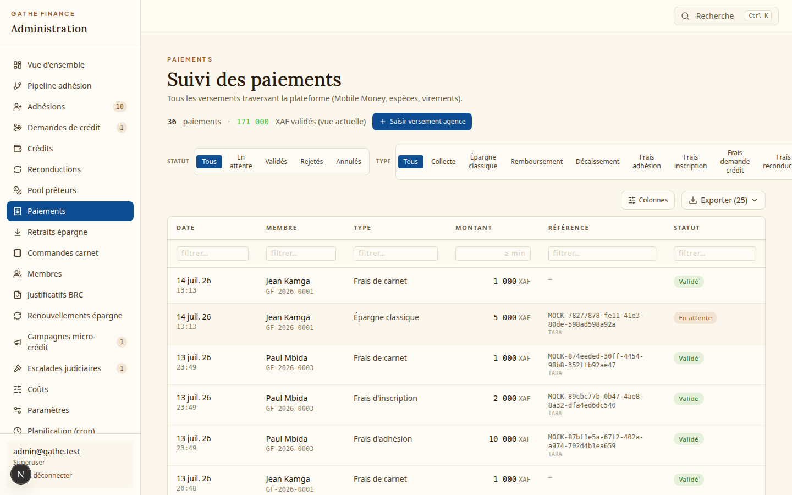

**Tous** les paiements entrants et sortants sont tracés ici, avec une
**traçabilité complète** de chaque flux financier.

### Le statut d'un paiement

| Étape | Signification |
|---|---|
| :chip[Initialisé] | La demande est envoyée au prestataire de paiement |
| :chip[En cours] | Le prestataire traite la transaction |
| :chip[Succès] | La transaction est confirmée |
| :chip[Échec] | La transaction a été rejetée (raison affichée) |

### Les colonnes affichées

- **Date et heure** précises
- **Opération liée** : versement, frais, remboursement, payout crédit
- **Membre** (numéro et nom)
- **Montant** et **canal** (Mobile Money, agence)
- **Référence** unique

### La reconciliation manuelle

En cas de désynchronisation rare, l'administrateur peut **forcer le
statut** d'un paiement en s'appuyant sur une preuve (capture d'écran,
accusé du prestataire). L'action est tracée dans le journal d'audit.

---

# 7. Les retraits d'épargne

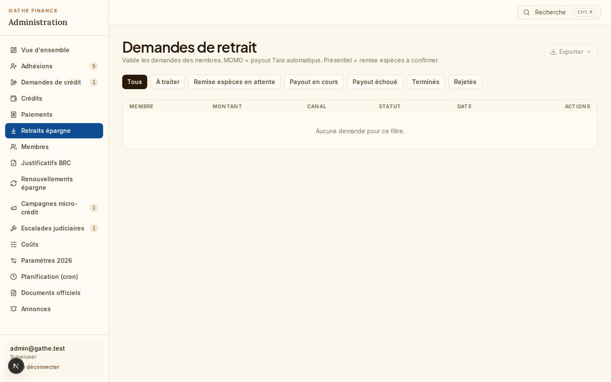

Les demandes de retrait soumises par les membres arrivent ici pour
**instruction**.

### Les éléments d'une demande

- **Demandeur**, **montant**, **motif**
- **Canal de payout** souhaité : :chip[Mobile Money] ou :chip[Agence]
- **Solde disponible** au moment de la demande

### Les décisions possibles

- :btn[Accepter — Mobile Money] : déclenche un payout automatique
- :btn[Accepter — Agence] : programme un retrait en agence
- :btnOutline[Refuser] : demande un motif obligatoire

<blockquote>

Le **débit du solde est instantané** et garanti unique — aucun risque
de double-retrait, même en cas d'opérations simultanées.

</blockquote>

---

# 8. L'annuaire des membres

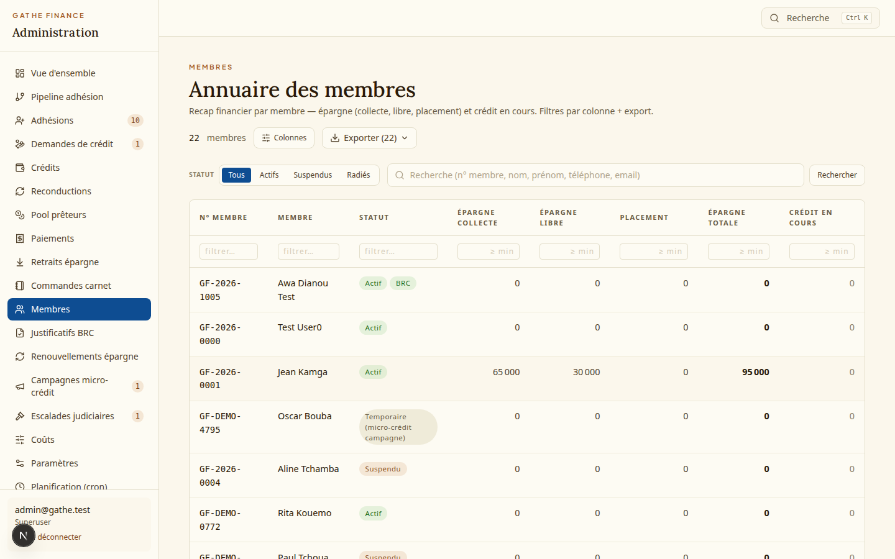

**Annuaire central** de tous les membres, avec leurs informations clés.

### Les filtres disponibles

- Par **statut** : actif, suspendu, radié
- Par **agence** d'inscription
- Par **solde épargne** (tranches)
- Par **encours crédit** (tranches)
- Par **ancienneté** (moins d'1 an, 1-3 ans, plus de 3 ans)

### La fiche détail d'un membre

En cliquant sur un membre, l'administrateur accède à :

- **Identité complète** et coordonnées
- **Solde épargne** et historique des transactions
- **Crédits** (en cours et passés)
- **Échéances** à venir
- **Notifications** envoyées
- **Journal d'audit** des actions menées sur son compte

### L'export

Bouton :btn[Exporter] qui propose :

- :tab[Export CSV] — pour Excel ou un tableur
- :tab[Export PDF] — pour archivage ou impression

---

# 9. Les justificatifs BRC

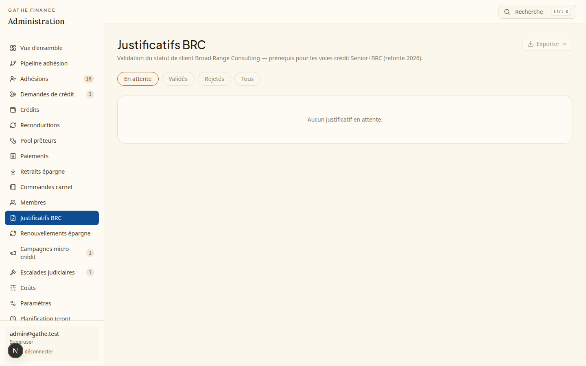

Pipeline de validation des **bordereaux de remise de chèque** et autres
justificatifs de paiement présentiel déposés par les agents.

### Le contenu d'un dossier

- **Membre** concerné
- **Montant** à créditer
- **Type d'opération** : épargne, frais d'adhésion, frais carnet…
- **Scan du justificatif** (PDF ou image) avec **aperçu intégré**
- **Agent** qui a saisi

### Les actions de validation

- :btn[Valider] — crédite immédiatement le compte du membre et envoie
  une notification de confirmation
- :btnOutline[Rejeter] — motif obligatoire, le membre est notifié

<blockquote>

L'aperçu du document est **intégré à l'écran** — pas besoin de
télécharger le fichier pour vérifier.

</blockquote>

---

# 10. Les renouvellements épargne

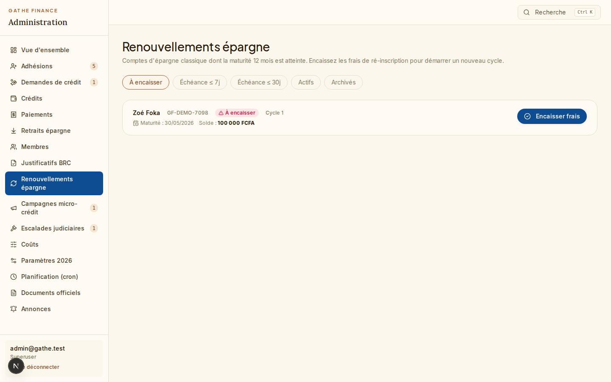

Gestion du **cycle anniversaire** des contrats d'épargne 12 mois.

### Le calendrier automatique

Un programme quotidien envoie automatiquement les notifications aux
membres concernés :

- **J-30** : « Ton contrat épargne arrive à échéance le … »
- **J-7** : rappel pour préparer la décision
- **J-1** : dernière chance d'opter pour la non-reconduction

### Les actions de l'administrateur

- **Visualiser** la liste des contrats arrivant à échéance
- **Marquer** un contrat en non-reconduction (sur demande du membre)
- **Renouveler** manuellement un contrat à la main si besoin
- **Voir** la chronologie des renouvellements passés

---

# 11. Les campagnes micro-crédit

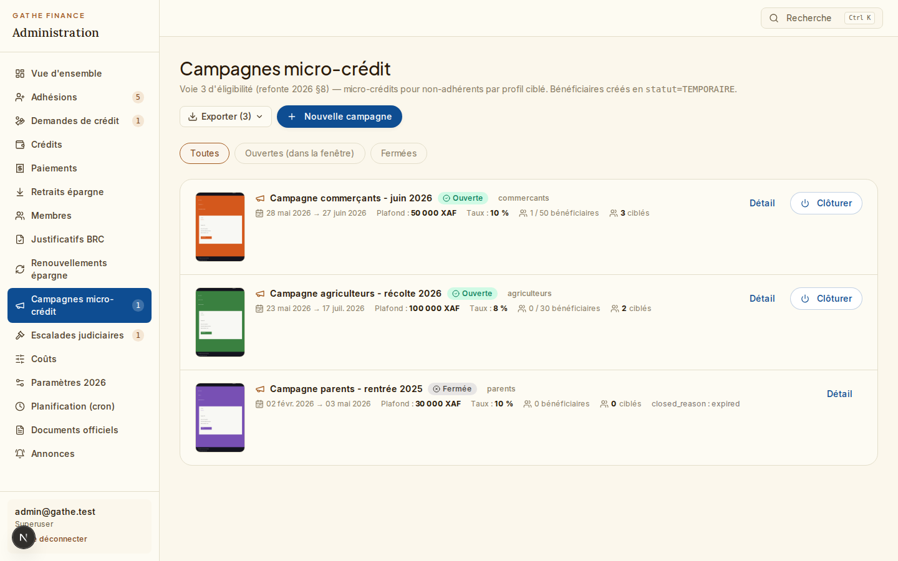

Création et suivi des **campagnes de micro-crédit** (la 3e
voie du modèle 2026).

### Les paramètres d'une campagne

- **Nom** et **description**
- **Audience cible** : tous, actifs, suspendus, sélection
- **Montant total** alloué à la campagne
- **Montant maximum** par bénéficiaire
- **Taux** spécifique (peut différer du taux standard)
- **Durée** des crédits (en mois)
- **Dates** d'ouverture et de clôture

### Le formulaire de création en image

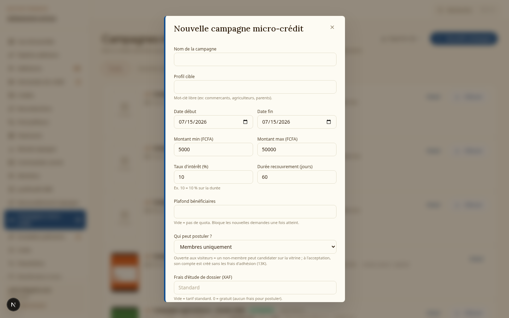

Une boîte de dialogue regroupe tous les paramètres : nom, profil cible,
dates début/fin, montants min/max, taux d'intérêt, durée de recouvrement,
plafond de bénéficiaires, et upload optionnel d'un **flyer image**.

### Les sorties automatiques

À la création :

- Génération du **flyer PDF** prêt à imprimer ou partager
- Création d'une **page de présentation** publique
- **Notifications** envoyées à l'audience cible

À la clôture :

- **Export CSV** des souscripteurs
- **Export PDF** récapitulatif pour rapport

---

# 12. Les escalades judiciaires

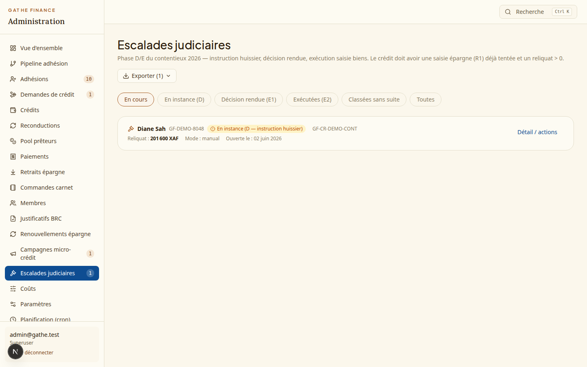

Suivi des dossiers de **contentieux**, organisés en **5 phases** selon
le modèle 2026.

### Les phases du contentieux

| Phase | Description |
|---|---|
| **A — Mise en demeure** | Lettre formelle (Article 13) |
| **B — Tentative amiable** | Médiation interne, négociation |
| **C — Recouvrement amiable** | Société de recouvrement externe |
| **D — Phase judiciaire** | Saisine du tribunal compétent |
| **E — Exécution** | Saisie ou recouvrement forcé |

### Le suivi d'un dossier

Pour chaque dossier en contentieux :

- **Crédit** concerné et **montant restant**
- **Phase actuelle** et **date** d'entrée
- **Historique** des actions menées
- **Pièces justificatives** (lettre, courrier, procès-verbal)
- **Prochaine échéance** d'action

<blockquote>

L'avancement d'une phase à la suivante est **tracé** dans le journal
d'audit avec l'agent responsable.

</blockquote>

---

# 13. Les coûts (frais &amp; taux)

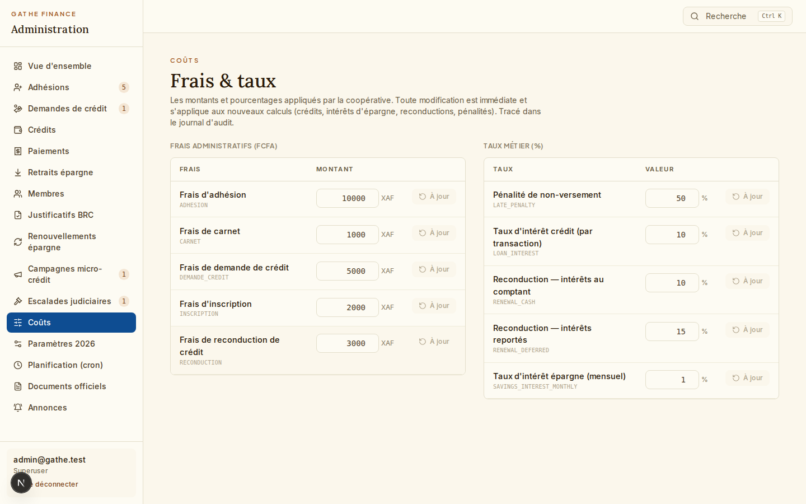

Édition centralisée de **tous les frais et taux** appliqués dans la
coopérative.

### Les frais éditables

| Frais | Valeur par défaut | Périodicité |
|---|---|---|
| Adhésion | 10 000 XAF | Une seule fois |
| Inscription | 2 000 XAF | Une seule fois |
| Carnet de collecte | 1 000 XAF | Par carnet |
| Frais de dossier crédit | Selon paliers | Par demande |

### Les taux éditables

- **Taux annuel d'épargne** (1 % par défaut, Article 4)
- **Taux de transaction crédit** (10 % par défaut)
- **Commission de collecte** (1 % par défaut)
- **Pénalité de retard** (50 %, Article 12-13)

<blockquote>

Toute modification est **immédiatement effective** pour les nouvelles
opérations. Les opérations en cours ne sont pas impactées.

</blockquote>

---

# 14. Les paramètres

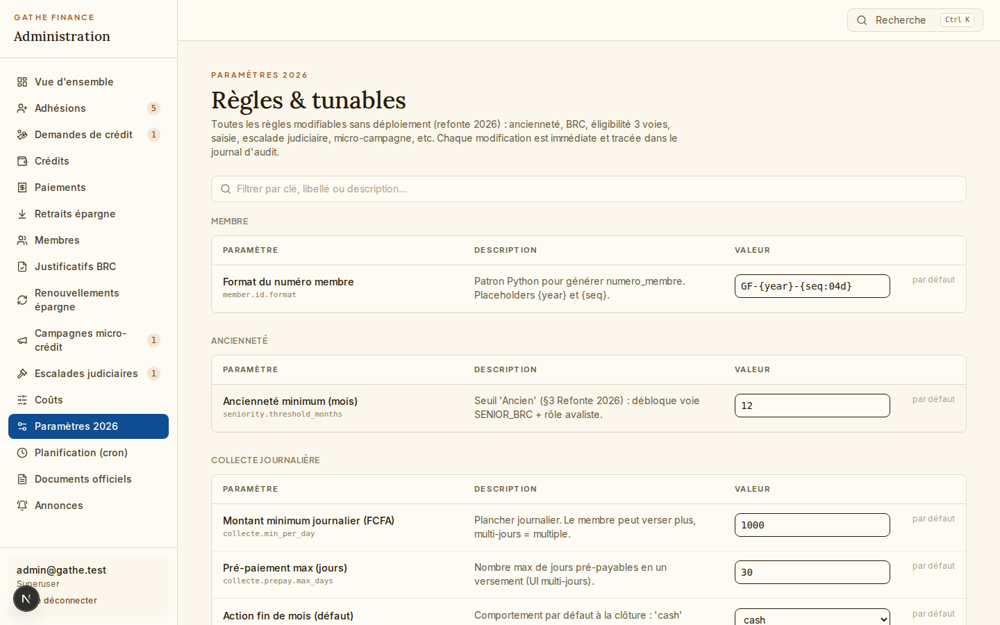

Interface dédiée aux réglages fins de la plateforme.

### Les catégories de paramètres

- :chip[Financement] — délais et états du financement prêteur
- :chip[Répartition d'intérêts] — partage entre coopérative et prêteur
- :chip[Éligibilité crédit] — seuils des 3 voies
- :chip[Contentieux] — durées et règles des phases
- :chip[Audiences] — paramètres par défaut pour les annonces
- :chip[Cycle anniversaire] — fenêtres de notification

### L'édition

Chaque paramètre est éditable directement, avec :

- **Nom** du paramètre
- **Description** en langage clair
- **Valeur actuelle**
- **Valeur par défaut** rappelée
- Bouton :btn[Réinitialiser] qui remet la valeur d'origine

<blockquote>

Toutes les modifications sont **auditées** avec l'agent et la date du
changement.

</blockquote>

---

# 15. La planification automatique

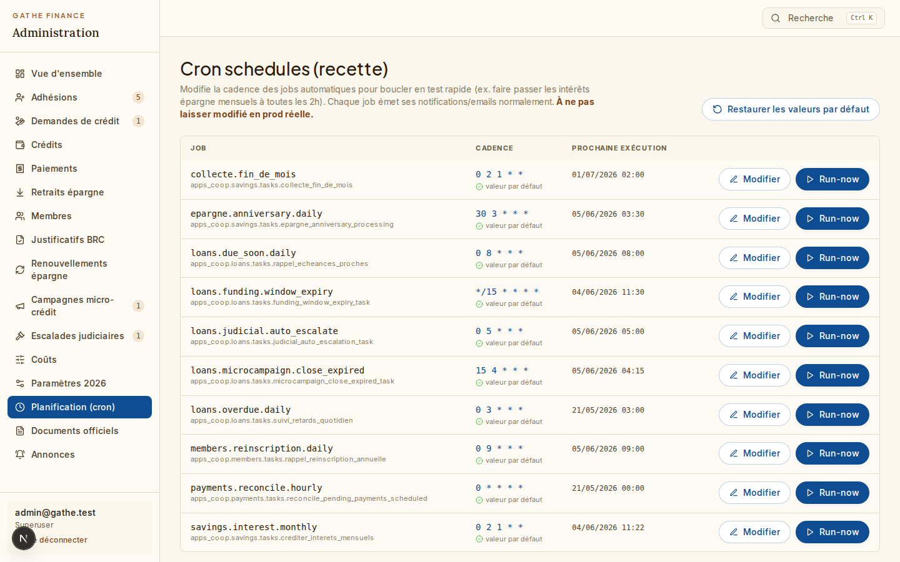

Édition de la **cadence des tâches programmées** qui s'exécutent
automatiquement (calcul d'intérêts, prélèvements de commission,
pénalités de retard, notifications…).

### Les tâches actives

| Tâche | Cadence par défaut | Rôle |
|---|---|---|
| Intérêts d'épargne | 1er du mois à 00h05 | Crédite 1 %/mois (Article 4) |
| Commission de collecte | Dernier jour à 23h55 | Prélève la commission 1 % |
| Suivi des retards | Quotidien à 00h15 | Applique la pénalité 50 % (Article 12-13) |
| Cycle anniversaire | Quotidien à 08h00 | Notifications J-30 / J-7 / J-1 |
| Financement (24 h) | Toutes les heures | Avance le financement prêteur |

### Les actions disponibles

- :btn[Modifier la cadence] — éditer la fréquence d'exécution
- :btn[Exécuter maintenant] — rejouer manuellement (utile pour
  rattraper un oubli ou recalculer après un changement de paramètre)
- :tab[Historique] — voir les 100 dernières exécutions

---

# 16. Les documents officiels

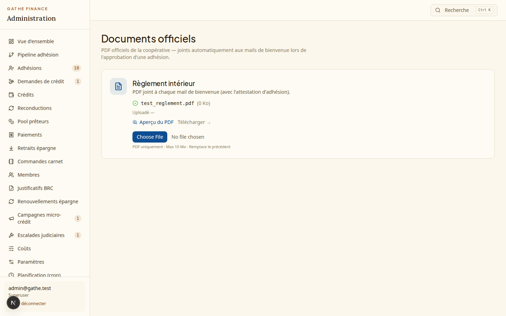

Centralisation des **documents officiels** de la coopérative.

### Les documents gérés

- :chip[Règlement Intérieur] (PDF) — version en vigueur
- :chip[Statuts] de la coopérative
- :chip[Agrément] administratif
- :chip[Notes de service] internes
- :chip[Politique de confidentialité]

### Les fonctionnalités

- **Upload** d'un nouveau document avec **versioning automatique**
- **Aperçu** intégré du document courant
- **Téléchargement** de la version en vigueur
- **Historique** des versions précédentes (lecture seule)

### L'attachement automatique

Le **Règlement Intérieur** est **automatiquement attaché** à l'email
:chip[Bienvenue] envoyé aux nouveaux membres après leur acceptation.

---

# 17. Les annonces broadcast

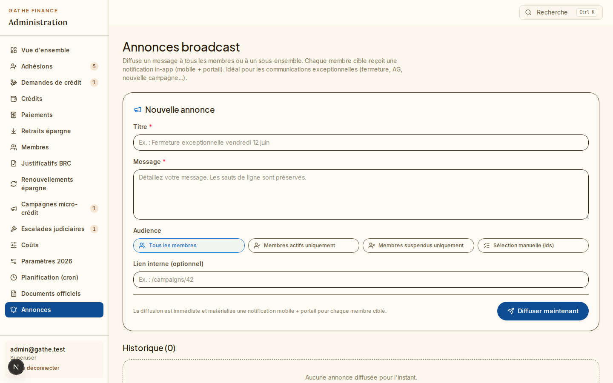

L'écran d'**annonces** permet de pousser un message à toute la
communauté ou à un sous-ensemble ciblé, en une seule action.

### Le formulaire d'annonce

- **Titre** (obligatoire, court — affiché en gras)
- **Corps** (texte libre)
- **Audience** :
  - :tab[Tous les membres]
  - :tab[Actifs uniquement]
  - :tab[Suspendus uniquement]
  - :tab[Sélection manuelle]
- **Lien optionnel** (vers une page ou un article)
- :btn[Diffuser maintenant]

### Ce qui se passe à la diffusion

1. Une notification est générée **pour chaque membre cible**
2. La réception est **immédiate** sur le portail web et l'application
   mobile (icône campagne, titre + corps complet)
3. La diffusion est **idempotente** — pas de doublon possible

### Le formulaire d'annonce en image

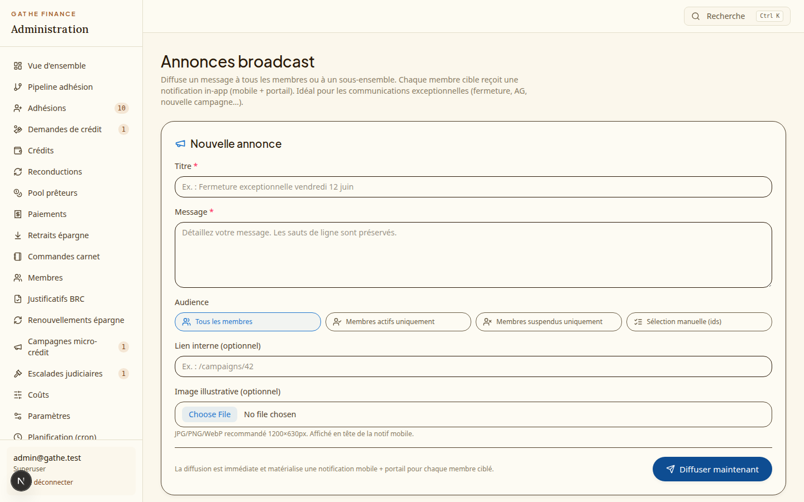

Le formulaire affiche en un seul écran : titre, message, sélecteur
d'audience (4 chips), lien interne optionnel et bouton :btn[Diffuser maintenant].

### Le suivi d'une annonce

Une fois diffusée, l'annonce reste visible avec :

- **Date** d'envoi
- **Nombre de destinataires** effectifs
- **Nombre de lus** (mis à jour en temps réel)
- :btn[Voir le détail] — qui a lu, qui n'a pas lu

---

# 18. Bonnes pratiques administrateur

### Vérifier les badges chaque matin

Les **badges rouges** dans la barre latérale pointent vers les dossiers
prioritaires. Faire le tour à la prise de poste évite les retards.

### Saisir des motifs explicites

À chaque refus (adhésion, crédit, BRC, retrait), prendre le temps de
saisir un motif **clair et complet**. C'est ce que verra le membre dans
sa notification.

<blockquote>

Un motif clair évite les **relances** et les **incompréhensions**
ultérieures.

</blockquote>

### Utiliser la recherche globale

`Ctrl + K` est le **raccourci magique** : taper un nom, un numéro ou
une date te conduit directement au bon dossier en quelques secondes.

### Programmer les annonces aux heures de pointe

Pour maximiser la lecture, viser :

- **08h00 — 09h00** : début de journée
- **12h00 — 13h00** : pause déjeuner
- **18h00 — 19h00** : retour au domicile

### Sauvegarder les exports régulièrement

Pour les rapports mensuels et trimestriels, exporter chaque section
avant le 5 du mois suivant.

### Tenir le journal d'audit propre

Toutes les actions sensibles sont **automatiquement journalisées**, mais
l'agent peut ajouter un **commentaire libre** pour expliquer une
décision inhabituelle.

### Hiérarchie de décision

1. **Agent d'accueil** — saisies, consultation
2. **Comité crédit** — décisions crédit
3. **Superviseur** — paramètres, contentieux
4. **Direction** — politique générale

---

# 19. Coordonnées &amp; support

### Agence

**GATHE Finance — Akwa Bercy, Douala**
Lundi à vendredi · 08h00 — 17h00

### Support technique interne

- **Hotline interne** — numéro disponible auprès du superviseur
- **Email support** — adresse interne de la coopérative

### Évolutions et suggestions

Les **demandes d'évolution** du dashboard sont collectées par le
superviseur et priorisées par la direction lors des points
trimestriels.

### En cas d'incident

1. **Documenter** : capture d'écran, heure, actions menées
2. **Notifier** immédiatement le superviseur
3. **Préserver** les pièces en l'état
4. **Faire** un compte-rendu écrit sous 24h

---

*Manuel préparé par TCHAMBA TCHAKOUNTE Edwin — juin 2026.*
